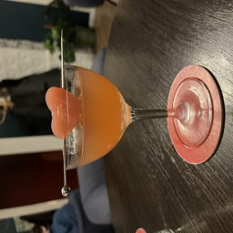
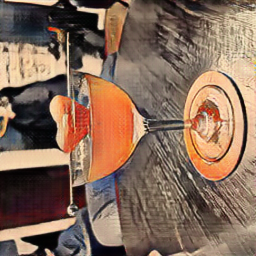
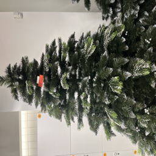
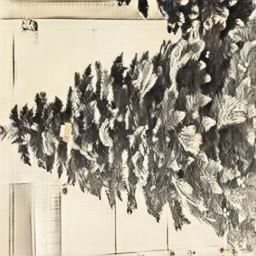
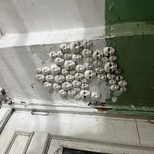
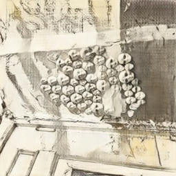
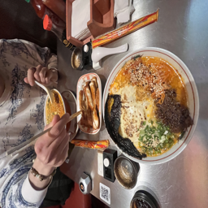
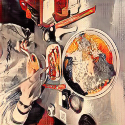
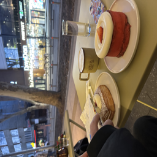
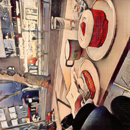

# CycleGAN Style Transfer — Ukiyo-e

This repository contains my implementation of **CycleGAN style transfer** using a pretrained model to convert real photographs into **Ukiyo-e woodblock print style** (Japanese art).

This was done as part of a university lab assignment exploring image-to-image translation using Generative Adversarial Networks.

---

## Base Repository

This project builds on the official CycleGAN and pix2pix PyTorch implementation by Jun-Yan Zhu et al.:

> https://github.com/junyanz/pytorch-CycleGAN-and-pix2pix

---

## Setup

### 1. Clone the repository

```bash
git clone https://github.com/junyanz/pytorch-CycleGAN-and-pix2pix
cd pytorch-CycleGAN-and-pix2pix
```

### 2. Create and activate a virtual environment

```bash
~/.pyenv/versions/3.10.12/bin/python -m venv ~/cyclegan-venv
source ~/cyclegan-venv/bin/activate
```

### 3. Install dependencies

The original repo does not include a `requirements.txt` that installs cleanly on Apple Silicon, so the following packages were installed manually:

```bash
pip install torch torchvision
pip install dominate
pip install wandb
pip install Pillow
```

### 4. Download the pretrained Ukiyo-e model

The pretrained model was downloaded from the official Berkeley repository:

> https://efrosgans.eecs.berkeley.edu/cyclegan/pretrained_models/

```bash
mkdir -p checkpoints/style_ukiyoe_pretrained
```

### 5. Prepare test images

```bash
mkdir -p datasets/ukiyoe_test/testA
```

> **Note:** iPhone photos in HEIC format disguised as `.jpg` will cause a `PIL.UnidentifiedImageError`. Convert them first using the built-in Mac `sips` tool:
>
> ```bash
> cd datasets/ukiyoe_test/testA
> for f in *; do sips -s format jpeg "$f" --out "${f%.*}.jpg" 2>/dev/null; done
> ```

---

## Running the Test

```bash
python test.py \
  --dataroot datasets/ukiyoe_test/testA \
  --name style_ukiyoe_pretrained \
  --model test \
  --no_dropout
```

Results are saved to `results/style_ukiyoe_pretrained/test_latest/images/`.

---

## Results

Each image shows the **original photo (real)** alongside the **Ukiyo-e styled version (fake)**.

### Image 1

| Real                                                                          | Ukiyo-e Style                                                                 |
| ----------------------------------------------------------------------------- | ----------------------------------------------------------------------------- |
|  |  |

### Image 2

| Real                                                                          | Ukiyo-e Style                                                                 |
| ----------------------------------------------------------------------------- | ----------------------------------------------------------------------------- |
|  |  |

### Image 3

| Real                                                                          | Ukiyo-e Style                                                                 |
| ----------------------------------------------------------------------------- | ----------------------------------------------------------------------------- |
|  |  |

### Image 4

| Real                                                                          | Ukiyo-e Style                                                                 |
| ----------------------------------------------------------------------------- | ----------------------------------------------------------------------------- |
|  |  |

### Image 5

| Real                                                                          | Ukiyo-e Style                                                                 |
| ----------------------------------------------------------------------------- | ----------------------------------------------------------------------------- |
|  |  |

---

## Reference

> Unpaired Image-to-Image Translation using Cycle-Consistent Adversarial Networks  
> Jun-Yan Zhu, Taesung Park, Phillip Isola, Alexei A. Efros  
> ICCV 2017  
> https://arxiv.org/abs/1703.10593
